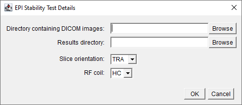
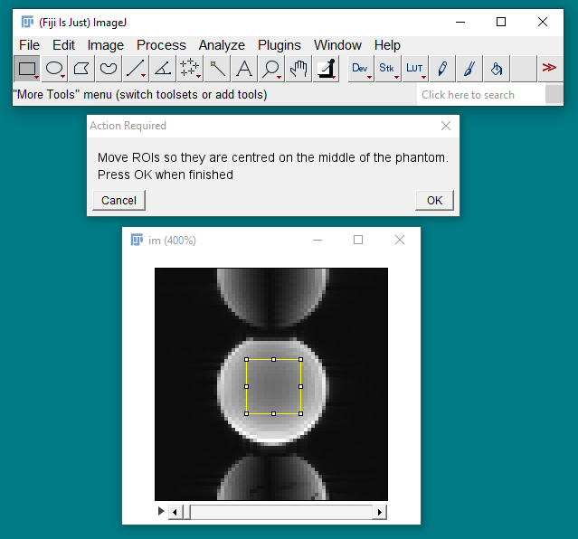
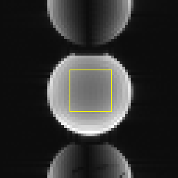

# EPI Stability Test
## Data Acquisition
Acquire 120 2D **echo-planar** images (EPI) of the MagNET flood-field test object using the receive-only head coil:

>[!TIP]
> The doped water test object should be used for 1.5 T MR systems and the oil 
> filled test object should be used for 3 T MR systems.

### Subject Registration
Register the subject with the following details:

| Parameter | Value |
|-----------|-------|
| Name | SCANNERNAME_DATE_AQA |
| Date-of-Birth | 01/01/2001 |
| Height | 180 cm |
| Weight | 80 kg |

### Positioning the Test Object
- Position the test object in the centre of the RF coil and then move it to the iso-centre.
- Use sandbags or straps to secure the test object in place as required.
- Leave approximately five minutes between positioning the test object and starting the data acquisition to allow the contents of the test object to settle.

### Localiser Images
Check the positioning of the test object by acquiring a 3-plane localiser scan.

### Pulse Sequence Parameters
Use the following pulse sequence parameters:

| Parameter | Value |
|-----------|-------|
| TE        | 90 ms |
| TR        | 1000 ms |
| Averages  | 1     |
| Slice thickness  | 5 mm |
| Slice orientation| TRA |
| Number of slices | 1 |
| Matrix size | 64 by 64 |
| Field-of-view | 382 by 382 mm (minimum) |
| Bandwidth | System dependent (see below) |
| Acquisition time | 2:00|

The system dependent bandwidths are:

| System | Bandwidth |
|--------|-----------|
| Siemens | 5208 Hz/Px|
| Philips 1.5 T | 0.04 Px fat-water shift |
| Philips 3 T | 0.08 Px fat-water shift |

Set the series description to HC_EPI.

## Data Analysis
1. Download [Fiji](https://imagej.net/software/fiji/) if required.

2. Open [Fiji](https://imagej.net/software/fiji/):
    

3. Load [ImageJ macro](../macros/epi_stability.ijm):
    

4. When prompted, enter the directory containing the 120 images and the results directory as well as the slice orientation and RF coil details:
    

5. When prompted, move the ROI to the centre of the test object as required. Click OK to proceed:
    

>[!TIP]
> Clicking "Cancel" will quit the macro

## Results
The following files are generated in a directory called `Analysis Results`:
- `HC_TRA_EPI_STABILITY.csv`: csv file containing the mean signal from the ROI in last 100 images (the first 20 images are discarded).
- `HC_TRA_EPI_STABILITY_ROI.png`: screen-grab showing the image and the ROI.
    
- `HC_TRA_EPI_STABILITY_ROI.zip`: zip file containing the ROI used to measure the signal stability.
