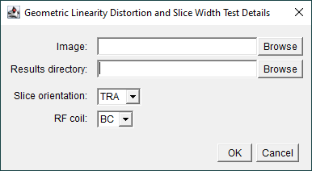
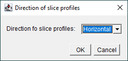

# Geometric Distortion, Linearity and Slice Width Tests
## Acquisition
Acquire one conventional 2D **spin-echo** image of the MagNET geometric/slice width test object using the in-built transmit-receive body coil:

### Subject Registration
Register the subject with the following details:

| Parameter | Value |
|-----------|-------|
| Name | SCANNERNAME_DATE_AQA |
| Date-of-Birth | 01/01/2001 |
| Height | 180 cm |
| Weight | 80 kg |

### Positioning the Test Object
- Position the test object in the centre of the RF coil and then move it to the iso-centre.
- The slice profiles should be parallel to the patient table to within 1 degree.
- Use sandbags or straps to secure the test object in place as required.
- Leave approximately five minutes between positioning the test object and starting the data acquisition to allow the contents of the test object to settle.

### Localiser Images
Check the positioning of the test object by acquiring a 3-plane localiser scan.

### Pulse Sequence Parameters
Use the following pulse sequence parameters:

| Parameter | Value |
|-----------|-------|
| TE        | 30 ms |
| TR        | 1000 ms |
| Averages  | 1     |
| Slice thickness  | 5 mm |
| Slice orientation| TRA, COR and SAG |
| Number of slices | 1 |
| Matrix size | 256 by 256 |
| Field-of-view | 250 by 250 mm |
| Bandwidth | System dependent (see below) |
| Image Filter| 2D Distortion Correction|
| Acquisition time | 4:16|

The system dependent bandwidths are:

| System | Bandwidth |
|--------|-----------|
| Siemens | 130 Hz/Px|
| Philips 1.5 T | 1.69 Px fat-water shift |
| Philips 3 T | 3.38 Px fat-water shift |

Set the series description to BC_GEO_{TRA/COR/SAG}.

> [!NOTE]
> This should result in a total of 3 images, one in the axial plane, one in the coronal plane and one in the sagittal plane

## Data Analysis
1. Download [Fiji](https://imagej.net/software/fiji/) if required.

2. Open [Fiji](https://imagej.net/software/fiji/):
    

3. Load [ImageJ macro](../macros/geometric_distortion_linearity_and_slice_width.ijm):
    

4. When prompted, enter the filepath of the image and the results directory as well as the slice orientation and RF coil details:
    

5. When prompted, after looking at the image, enter the direction of the slice profiles:
    
    
    Click OK to proceed:
    

6. The position of the rods will be determined automatically. When prompted, move them if needed:
    

>[!TIP]
> Clicking "Cancel" will quit the macro

Repeat steps 3-6 for the axial, coronal and sagittal data.

## Results
For each slice orientation the following files are generated in a 
directory called `Analysis Results`:

- `BC_TRA_GEOMETRIC_LINEARITY_DISTORTION.csv`: csv file containing the distances between the rods which are used to calculate the linearity and distortion.
- `BC_TRA_GEOMETRIC_LINEARITY_DISTORTION_LINES.png`: screen-grab showing the image and lines used to calculate the linearity and distortion.
    
- `BC_TRA_GEOMETRIC_LINEARITY_DISTORTION_LINES.zip`: zip file containing the ROIs used to measure the linearity and distortion.
- `BC_TRA_SLICE_WIDTH_1.csv`: csv file containing the signal profile from a horizontal ROI over the first slice wedge.
- `BC_TRA_SLICE_WIDTH_2.csv`: csv file containing the signal profile from a horizontal ROI over the second slice wedge.
- `BC_TRA_SLICE_WIDTH_ROIs.png`: screen-grab showing the image and 2 ROIs used to measure the slice width.
    
- `BC_TRA_SLICE_WIDTH_ROIs.zip`: zip file containing the ROIs used to measure the slice width.