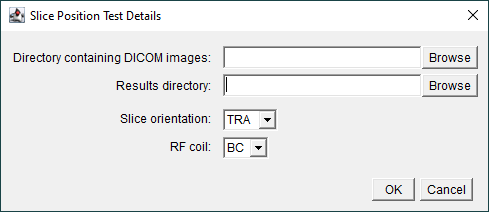

# Slice Position Test
## Acquisition
Acquire 2D multi-slice **spin-echo** images of the MagNET slice position test object using the in-built transmit-receive body coil:

### Subject Registration
Register the subject with the following details:

| Parameter | Value |
|-----------|-------|
| Name | SCANNERNAME_DATE_AQA |
| Date-of-Birth | 01/01/2001 |
| Height | 180 cm |
| Weight | 80 kg |

### Positioning the Test Object
- Position the test object in the centre of the RF coil and then move it to the iso-centre.
- The angled rods should be parallel to the patient table to within 1 degree.
- Use sandbags or straps to secure the test object in place as required.
- Leave approximately five minutes between positioning the test object and starting the data acquisition to allow the contents of the test object to settle.

### Localiser Images
Check the positioning of the test object by acquiring a 3-plane localiser scan.

### Pulse Sequence Parameters
Use the following pulse sequence parameters:

| Parameter | Value |
|-----------|-------|
| TE        | 30 ms |
| TR        | Minimum required to allow 27 slices |
| Averages  | 1     |
| Slice thickness  | 5 mm |
| Slice gap | 2.5 mm |
| Slice orientation| TRA |
| Number of slices | 27 |
| Matrix size | 256 by 256 |
| Field-of-view | 256 by 256 mm |
| Bandwidth | System dependent |
| Image Filter| 2D Distortion Correction|
| Acquisition time | Dependent on TR |

The system dependent bandwidths are:

| System | Bandwidth |
|--------|-----------|
| Siemens | 130 Hz/Px|
| Philips 1.5 T | 1.69 Px fat-water shift |
| Philips 3 T | 3.38 Px fat-water shift |

Set the series description to BC_SP_TRA.

## Data Analysis
1. Download [Fiji](https://imagej.net/software/fiji/) if required.

2. Open [Fiji](https://imagej.net/software/fiji/):
    

3. Load [ImageJ macro](../macros/slice_position.ijm):
    

4. When prompted, enter the directory containing the 27 images and the results directory as well as the slice orientation and RF coil details:
    

5. When prompted, after looking at the image, determine if the 4 parallel rods at edge of the test object and the two angled rods at the centre are visible:
    
    
    Click `No` if they are not:
    
    
    and `Yes` if they are:
    

6. When prompted, modify the polygon ROI to include the 6 rods:
    
    
    Click OK to proceed:
    
    
7. The position of the rods will be determined automatically. When prompted, move them if needed:
    
    i.e.
    

>[!TIP]
> Clicking "Cancel" will quit the macro

The macro will loop through all 27 slices, perform steps 5-7 for each.

## Results
The following files are generated in a directory called `Analysis Results`:
- `BC_TRA_SLICE_POSITION.csv`: csv file showing the distance between the angled rods in the middle of the test object as well as the mean distance between the 4 parallel rods at the edge of the test object on each slice.
- `BC_TRA_SLICE_POSITION_LINES.png`: screen-grab showing a montage of all the slices with the lines used to measure the distances overlayed.
    
