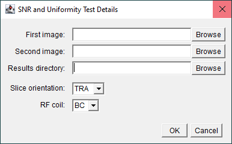

# Signal-to-Noise Ratio and Uniformity Tests
## Data Acquisition
Acquire two conventional 2D **spin-echo** images of the MagNET flood-field test object one after an other using the in-built transmit-receive body coil:

>[!TIP]
> The doped water test object should be used for 1.5 T MR systems and the oil 
> filled test object should be used for 3 T MR systems.

>[!NOTE]
> Two images are acquired as the signal-to-noise ratio is calculated using the 
> NEMA (subtraction) method.

### Subject Registration
Register the subject with the following details:

| Parameter | Value |
|-----------|-------|
| Name | SCANNERNAME_DATE_AQA |
| Date-of-Birth | 01/01/2001 |
| Height | 180 cm |
| Weight | 80 kg |

### Positioning the Test Object
- Position the test object in the centre of the RF coil and then move it to the iso-centre.
- Use sandbags or straps to secure the test object in place as required.
- Leave approximately five minutes between positioning the test object and starting the data acquisition to allow the contents of the test object to settle.

### Localiser Images
Check the positioning of the test object by acquiring a 3-plane localiser scan.

### Pulse Sequence Parameters
Use the following pulse sequence parameters:

| Parameter | Value |
|-----------|-------|
| TE        | 30 ms |
| TR        | 1000 ms |
| Averages  | 1     |
| Slice thickness  | 5 mm |
| Slice orientation| TRA, COR and SAG |
| Number of slices | 1 |
| Matrix size | 256 by 256 |
| Field-of-view | 250 by 250 mm |
| Bandwidth | System dependent (see below) |
| Image Filter| 2D Distortion Correction|
| Acquisition time | 4:16|

The system dependent bandwidths are:

| System | Bandwidth |
|--------|-----------|
| Siemens | 130 Hz/Px|
| Philips 1.5 T | 1.69 Px fat-water shift |
| Philips 3 T | 3.38 Px fat-water shift |

Set the series description to BC_{TRA/COR/SAG}_SNR.

> [!NOTE]
> This should result in a total of 6 images, two in the axial plane, two in the coronal plane and two in the sagittal plane

Repeat the above acquisitions with a receive-only head coil if one is available, seting the series description to HC_{TRA/COR/SAG}_SNR.

## Data Analysis
1. Download [Fiji](https://imagej.net/software/fiji/) if required.

2. Open [Fiji](https://imagej.net/software/fiji/):
    

3. Load [ImageJ macro](../macros/snr_and_uniformity.ijm):
    

4. When prompted, enter the file paths of the two SNR images and the results directory as well as the slice orientation and RF coil details:
    

5. When prompted, move the ROIs to the centre of the test object as required:
    

    Click OK to proceed:
    

>[!TIP]
> Clicking "Cancel" will quit the macro

Repeat steps 3-5 for the axial, coronal and sagittal data acquired with both the in-built transmit-receive body coil and receive-only head coil.

## Results
For each slice orientation and coil the following files are generated in a 
directory called `Analysis Results`:
- `BC_TRA_SNR.csv`: csv file containing the mean signal and standard deviation of the noise in each of the 5 ROIs.
- `BC_TRA_SNR_Images_with_ROIs.png`: screen-grab showing the images and the 5 ROIs used to calculate the SNR.
    
- `BC_TRA_SNR_ROIs.zip`: zip file containing the ROIs used to measure the SNR
- `BC_TRA_UNIFORMITY_HORIZONTAL.csv`: csv file containing the signal profile from a vertical ROI. 
- `BC_TRA_UNIFORMITY_VERTICAL.csv`: csv file containing the signal profile from a horizontal ROI.
- `BC_TRA_UNIFORMITY_ROIs.png`: screen-grab showing the image and 3 ROIs used to measure the uniformity.
    
- `BC_TRA_UNIFORMITY_ROIs.zip`: zip file containing the ROIs used to measure the uniformity.

